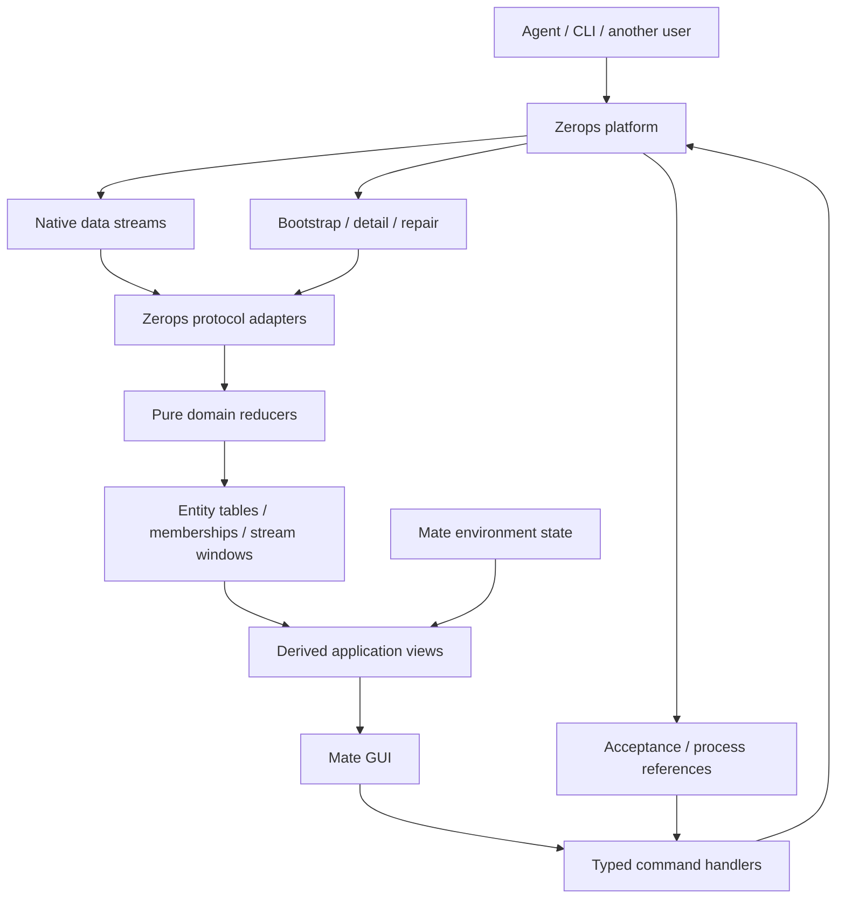

# Zerops live data architecture

Status: **implemented client architecture**, 2026-09-08. The existing web and
retained mobile Zerops data consumers use the central runtime. This remains an
observational client model, not a claim that every upstream source guarantee is proven.

Source baseline: Mate `2251deee8` (initial audit `5a571f3b0`), frontend-legacy
`c88b8fefb`, zcp `08e7dbae`, zerops-docs `4899cf0b`. Independent Fable 5.1 and
Astra reviews informed this decision. The [account contract](account-lifecycle.md)
remains unchanged. [zcp spec §5.1](../../../../zcp/docs/spec-mate.md#51-the-service-map-is-a-client-projection-of-the-zerops-api)
adopts this architecture and records its implemented scope.
See [the fixed consistency contract](platform-data-consistency.md) for implementable
source precedence, bootstrap/recovery and adapter admission requirements.

## Architectural decision

Build an **event-driven client with a normalized, reactive domain read model**.
Use **ports and adapters** to isolate Zerops protocols, **pure reducers** to maintain
domain state, and **command/query separation** to distinguish requested operations
from observed facts. This applies the CQRS principle on the client without
introducing event sourcing or another authoritative database.

The central abstraction is **the current observed platform model**: projects,
services, processes and their relationships. Every application surface reads
projections of this model. Datastreams update it regardless of who initiated a
change. Screens do not own separate copies of services or synchronization logic.

REST supplies initial state, missing details and recovery. Native stream payloads
supply ordinary live changes. The architecture has no general query-result cache,
stale-while-revalidate layer or TTL-based freshness contract. In-memory projection
state is necessary for rendering; retention does not make old observations current.
A disconnected model is explicitly unsynchronized.

Compose the system in one account-scoped **`ZeropsDataRuntime`** inside
`packages/client-runtime`: a composition root and public domain facade with small
domain modules underneath. The architecture is the model and its dependency rules;
the runtime is where those parts are assembled and their lifetimes are owned.

## Implemented shape

[`packages/client-runtime/src/zerops/data`](../../../packages/client-runtime/src/zerops/data)
contains the production runtime, domain types, reducers, Atom projections, source
policy, protocol and REST adapter, resource broker, build-log registry and typed
command facade. One runtime is created for an authenticated account before any
Mate environment connection. Web and mobile providers own that scope and dispose
it on logout or account replacement.

Account workers retain the scheduler supplied when the runtime is created, even
when later demand originates in independently run UI effects. The web provider
uses an account-owned `MessageChannel` task scheduler: each drain still yields to
the browser, without the cumulative delay of nested zero-duration timers. It
closes the channel after runtime shutdown completes. The desktop renderer uses
the same web provider; native mobile retains its platform's Effect scheduler.
This scheduling choice does not change access admission, queue budgets, receipt
ordering, transport deadlines or recovery policy.

The runtime now owns these paths:

- Shared organization receivers and leased inventory, activity and metric
  interests. Native list/update frames are admitted through one bounded ingress;
  REST supplies bootstrap, direct hydration and bounded recovery.
- Canonical Project, Service and Process records, separate query memberships and
  narrow Atom projections. Inventory, candidates, topology, activity and
  provisioning compose these projections instead of maintaining feature-owned
  watcher maps or polling loops.
- Configuration, export and token reads in an access-aware resource broker. Each
  acquire and retry checks the current account epoch, scope and absolute access
  deadline. Revocation or deadline expiry releases leases, aborts work and erases
  retained values.
- Build-log page/follow sessions in one bounded registry. Signed grants remain in
  the transport adapter; releasing the final lease aborts grant, page and follow
  work and removes the retained session.
- Typed project, service, import, token and restart commands. Accepted responses
  feed decoded observations and Process references back through the same model;
  every failure after the first write of a compound operation is non-retryable
  uncertainty.

A successful project creation or whole-project import under a currently authorized
organization records temporary access to the returned project so the same admitted
flow can continue into service import and topology observation. That fact keeps the
existing verification deadline, cannot cross account epochs or organization scope,
and is replaced by the next authoritative access verification.

Direct I/O remains only at declared boundaries: account authentication and access
verification, transport adapters, and location/container health or upgrade-readiness
probes. UI mutation paths call the runtime command facade. The deleted inventory
reconciliation, topology watcher, activity poller and feature-owned build-log
session have no parallel fallback owner.

Mate server connections have a separate lifetime from the platform receiver: each
registered environment owns its authenticated socket and initial shell snapshot.
The web client restores each remembered project/service target once per address
and explicit refresh, claiming the attempt before starting asynchronous work.
Inventory updates do not repeat failed or pending identity exchanges. Existing
registrations are reused, and a newly published catalog entry is retained while
its verified target identity is being recorded; routes still wait for that identity.
The sidebar and project picker share container health probes, including in-flight
work, for the account's current explicit refresh cycle. Account closure clears
those probes. These web connection/probe rules also apply to the retained desktop
wrapper; the mobile source has its own connection entry flow.

## Why this fits Mate and legacy

The same service appears in navigation, topology, configuration, deployment
activity and agent results. Agents, CLI commands, other users and other clients
can start work. Operations produce processes that continue after the initiating
request or screen has finished. Central platform observation must therefore drive
the whole application, independently of command initiation.

This is the useful conceptual model already implemented in frontend-legacy:

- REST searches register `listStream` and `updateStream` on a shared receiver.
- `listStream` changes query membership by ID.
- `updateStream` updates normalized entity records.
- Selectors compose records into application views.
- Current and historical statistics have push subscriptions too; logs use a
  separate stream protocol.

Retain that concept, with explicit typed reducers and lifecycle ownership.
Legacy's Angular/NgRx action machinery, generic deep merges, subscription-name
parsing and incomplete reconnect handling are implementation choices to replace.
The earlier proposal treated native streams primarily as invalidation signals;
that architectural preference is superseded by this document.

## Domain model

Organize modules by platform meaning, not by screen or HTTP endpoint:

| Domain              | Owns                                                                                                     |
| ------------------- | -------------------------------------------------------------------------------------------------------- |
| Identity and access | Account, organizations, memberships and independently verified effective project access.                 |
| Inventory           | Projects, services, instances, their relationships and actual platform status.                           |
| Configuration       | Explicit project/service facets: capabilities, settings, routes, environment variables and integrations. |
| Activity            | Processes, builds/app versions and operation relationships actually supplied by the platform.            |
| Observability       | Current samples, historical windows and log sessions, with specialized bounded representations.          |

Mate environments/workspaces/threads/tool observations remain a separate source.
Personal navigation and form drafts are another source. Application views join
these sources through stable identities; they do not copy Mate facts into platform
records. A Mate workspace project and a Zerops platform project use distinct types.

| Representation    | Meaning                                                                                                                                                              |
| ----------------- | -------------------------------------------------------------------------------------------------------------------------------------------------------------------- |
| Entity table      | One record per typed, scoped source ID for Project, ServiceStack and Process. Domain reducers own the records. Normalize these shared entities from the first slice. |
| Relationship      | Stable references such as service → project and process → affected services. Names and URLs locate entities; they do not identify them.                              |
| Query membership  | Ordered IDs plus filter/sort/window and completeness. Query results reference shared records rather than own copies.                                                 |
| Detail facet      | Separately loaded/observed fields with explicit ownership and access, such as configuration. Summary rows cannot erase richer detail by arriving later.              |
| Current telemetry | Latest values keyed by entity and metric dimensions, separate from inventory records.                                                                                |
| Historical window | Time buckets keyed by dimensions, interval, range and timezone; explicit bucket correction and window replacement semantics.                                         |
| Log session       | Bounded lines/pages, source cursor, gaps and follow state, with its own transport and grant lifetime.                                                                |
| Command attempt   | What this client requested, acceptance/uncertainty and explicit process references. This is not the platform process itself.                                         |
| Derived view      | Pure composition for navigation, topology, activity or settings; owns no source facts.                                                                               |
| Form draft        | Base observation, current platform observation and local edits. Live updates and unsaved edits remain distinct.                                                      |

Normalize shared objects, not every nested value. Ports can remain an owned value
inside a service facet; another independently changing service is a reference.

Membership is distinct from existence: a finished process leaves the running list
but remains available in activity/history. An added ID may precede its record;
retain an unresolved reference and hydrate it once rather than silently dropping
or inventing the entity. Missing items in partial or filtered results do not prove
deletion. Confirmed removal/access loss fences affected state and old callbacks.

Keep platform state separate from UI interpretation. A view can show a restart
process alongside a service's last observed status; it does not overwrite the
service record with a synthetic status. Agent-reported success, process completion
and current service state are different observations and can arrive separately.

## Data flow

1. Adapters decode untrusted DTOs/frames into typed domain observations.
2. Pure reducers apply admissible snapshots, record changes and membership changes.
   Domain/facet ownership and source precedence are explicit; no generic deep merge.
3. Runtime services own account scope, shared subscriptions, ingestion, recovery,
   access guards and disposal.
4. Read projections expose entity/collection reads and named views through atoms.
5. Command handlers invoke operations and track acceptance or uncertainty. Shared
   process observations provide their subsequent progress where correlation exists.

Use existing Effect services, Layers and Scopes for execution and Atom families
for reactive reads. Pure domain types/reducers remain independent of React.
Existing [`state/server.ts`](../../../packages/client-runtime/src/state/server.ts)
and [`serverConfigProjection.ts`](../../../packages/client-runtime/src/state/serverConfigProjection.ts)
demonstrate this separation. Platform state is a sibling of Mate environment
state: it must work before any container connection exists.

## Commands and asynchronous processes

For a restart initiated from settings: the handler sends the command and records
acceptance, including a process reference if returned. Process observations update
the shared process table; service observations update the shared service record.
All relevant views react without a settings callback or feature-specific refetch.
An operation view can distinguish a completed process from a service observation
that is still catching up.

If an agent, CLI or another user starts that restart, the same observation path
works without a local command attempt. Observation must outlive the initiating
screen. Include every supported terminal process state, including failure and
cancellation; legacy's restricted update filter is not a pattern to copy.

One command may affect several resources and reference multiple processes; more
processes can appear later. Link them through explicit source-provided IDs and
relationships. Without parent/correlation IDs, show independent processes or
clearly tentative attribution. Time proximity or a hostname does not establish
causality. Do not invent a client workflow engine predicting platform behavior.

A lost response means an uncertain command outcome. Local correlation IDs do not
provide server idempotency; do not automatically resubmit non-idempotent operations.
Already accepted work continues after disconnect/logout. Admission is checked when
queued commands actually execute and before subsequent writes in multi-step work.

## Stable interfaces and modular implementation

Consumers read domain concepts: `service(ref)`, `servicesOf(projectRef)`,
`runningProcessesOf(projectRef)`, `operationProgress(ref)` and `usage(ref, window)`.
Commands express intent: `restartService`, `updateConfiguration`, `createProject`.
Bindings follow the existing Atom conventions; feature APIs expose no receiver ID,
websocket frame, query invalidation or cache TTL.

REST snapshots and native changes enter the same domain reducers. Each input policy
specifies accepted fields, replacement/patch semantics and ordering assumptions.
Accepting a JSON shape does not prove that it is a complete record replacement.
Overlapping summary/detail fields have one declared owner, not last-arrival wins.

Keep stable: identities, field/fact ownership, relationships, membership semantics,
command/query separation, access boundaries and public read concepts. Keep internal:
transport drivers, physical pooling, storage/index structures, batching and repair.
Future mechanism changes should not require screens to reinterpret a service.

Start with explicit domain modules and named selectors. Avoid a generic query
language, dynamic plugin registry, universal change bus or configurable merge
framework. New panels compose existing data; new domains add a source policy and
reducer. The central runtime composes them rather than containing their logic.

## Extension rules

Extend an existing domain by adding its scoped identity and owned fields, total
decoder, observation/reducer behavior, narrow projection and deterministic source
fixture. Add a new network path only behind an adapter. Retained configuration,
export, token or similar on-demand data belongs in the resource broker; paged or
followed logs belong in the log registry; platform mutations belong in the command
facade. A feature component may acquire a lease and read a projection, but it must
not own a duplicate snapshot, refresh timer, websocket registration or mutation
client.

Every new source declares snapshot versus patch behavior, membership and absence
meaning, field authority, required identities, coverage, access admission, bounds
and recovery. Every new view declares required and optional interests. Tests cover
account replacement, final-lease cleanup, late completion, access expiry and an
unrelated-entity publication case when the path retains or publishes state.

## Synchronization contract

Native entity/membership streams are the normal path for live inventory/activity.
Consume subscription responses for their query membership and unknown fields.
Indexed search does not supersede direct/push observations; required active project
scopes also have direct bootstrap/recovery anchors. The fixed consistency contract
defines these distinct roles. Metric subscriptions are also native; logs remain a
separately adapted stream.

Start with organization-scoped ServiceStack and Process list/update interests
shared by project views on an organization receiver. Project-list/access interests
are additional: those four subscriptions alone do not cover the whole platform.
Keep separate receivers across organizations until wider sharing is proven.
Telemetry/detail demand is explicit. Large-organization partitioning can change
behind the same interface after measurement; panels never choose transport scope.

Separate these concepts with small concrete states:

- Entity knowledge: unresolved, observed, authoritatively unavailable.
- Query coverage: complete scope, partial window, unresolved membership.
- Transport health: connection state.
- Domain/interest synchronization: establishing, observing under its declared
  guarantee, recovering, paused or failed. One open socket cannot conceal a failed
  subscription for a particular kind/query.
- Access: independently verified scope and deadline. Data arrival cannot renew it.

Derived views compose the state of their required interests and identify optional
ones separately. A failed usage stream can degrade usage without hiding a valid
service list. Avoid both a global `isLive` and a blanket worst-state rule that
turns every optional observation into a prerequisite for the whole application.

The model is explicitly observational, not a globally atomic platform/Mate snapshot.
`observing` means required registrations and baselines succeeded and no delivery
failure is known. It does not prove the last observation is current at the source.
Search responses contain `_version`; its meaning and comparability with pushes or
direct reads are unverified. Retain source metadata without assuming causal order.
Idempotence does not solve ordering. Legacy's use of a subscribe response does not
prove atomic snapshot/stream handoff. Applying buffered unversioned updates after
an unrelated REST snapshot can regress that snapshot. Use source watermarks/order
contracts where available; otherwise state the weaker observation guarantee and
prove the recovery procedure without claiming lossless or monotonic freshness.
The fixed policy fences direct reads against intervening push observations and
later-started applied reads, records completion even when values are suppressed,
and consumes native changes in local receipt order. These are local admission
rules, not source chronology. See the consistency contract for the complete
algorithm; implementers must not invent a different recovery policy per domain.

Resnapshot on reconnect, detected loss, rejected input or explicit refresh.
A healthy receiver drives data through native frames without periodic REST
traversals of the account. Heartbeats detect transport failure, not silent source
omissions; those can remain until a new baseline or explicit refresh. Keep that
limit in the observation guarantee. Overflow marks the affected interest
unsynchronized before recovery; dropped frames plus a GET are not automatically
correct. Read-only domains without push have explicit on-demand semantics and do
not advertise live synchronization.

Account-wide candidate discovery acquires only project/service inventory. Process
searches belong to visible topology or operation activity, and metrics/history
remain separate demand. Establishment and recovery pair subscription baselines
with one direct inventory/activity anchor for each demanded scope, so a stale search
response cannot prevent refreshing previously authoritative fields. Removing a
surface releases its demand. The independent
account verification window remains unchanged.

Local account/transport/interest generations fence obsolete work. Revocation stops
affected content and commands immediately; a sleeping tab cannot extend access
deadlines. Unstable paginated/search absence alone does not prove removal: verify
established targets through the appropriate direct access path before teardown.
A successful detail response still needs role/status evaluation.

## Editing under external changes

Forms keep base/current/draft separately. Streams advance current platform data;
local edits remain intact. Derive externally changed and conflicting fields,
resolve conflicts before replacement writes, and reset/discard to current state.

Use conditional writes/expected versions only where the backend enforces them.
A local timestamp or read-before-write cannot guarantee no lost updates. Whole-
document replacement endpoints need explicit command semantics; the ledger records
an env write replacing the complete environment set. Secrets and signed grants
have restricted lifetimes. No generic platform-state persistence is proposed.

The account-wide admission gate remains in force. A future change to per-scope
admission requires an explicit account-contract update; transport changes must
continue to preserve the existing gate.

## Alternatives and engine choice

| Choice                                                    | Assessment                                                                                                                                                  |
| --------------------------------------------------------- | ----------------------------------------------------------------------------------------------------------------------------------------------------------- |
| Per-query cache with invalidation                         | Rejected as the center. Shared identity and independently initiated asynchronous activity require central live observations.                                |
| Normalized reactive domain read model                     | Recommended concept. Matches the source streams, repeated entities, many observers and many initiating actors.                                              |
| Reactive client database / collection engine              | Credible engine beneath the same concept, particularly for substantial indexed joins. Does not replace platform protocol/access/operation semantics.        |
| Browser event sourcing / writable local-first replication | Adds durable log/replay/conflict obligations that the external platform does not provide. Keep the client projection disposable and platform-authoritative. |
| Server BFF owning platform data                           | Unnecessary for client centralization and contrary to the existing client-token ownership contract.                                                         |

Prefer existing Effect execution and Atom projections with explicit record tables
first. This is an engineering choice for this codebase, not a claim that Effect
is a database or makes every reducer O(1). Immutable copies, joins and publication
all count toward cost; measure the complete path.
Track affected IDs/relationships so named views can retain references when their
inputs did not change. Batch ingestion and publication under explicit budgets;
ingestion/access expiry must not depend on animation frames continuing in a hidden
tab. Rendering cadence is a consumer concern, separate from source synchronization.

[TanStack DB](https://tanstack.com/db/latest/docs/overview) offers collections,
live queries and custom sources; it is the strongest engine alternative if the
proof exposes a need for a general indexing/query engine. RTK Query supports
[streaming](https://redux-toolkit.js.org/rtk-query/usage/streaming-updates), but
deliberately does not [normalize across separate queries](https://redux-toolkit.js.org/rtk-query/usage/cache-behavior#no-normalized-or-de-duplicated-cache).
Library replacement alone would not choose the required domain model. Do not
build a homemade relational planner merely to preserve the initial engine choice.

## Implementation evidence

The first production slice proved normalized ServiceStack/Process state, separate
membership, a shared native receiver, pure topology/operation views, account scope,
snapshot recovery and one metric stream. The disposable live proof exercised a
runtime restart plus externally initiated stop/start operations; both converged
through the shared Process model without a caller refresh.

Required evidence: no per-event HTTP rereads for admitted native updates; shared
records/subscriptions across views; observation survives initiating-screen removal;
snapshots and native inputs work through the same public projections; terminal
process states and uncertain commands remain distinct; recovery obeys the actual
source contract; scope disposal rejects late work; sustained traffic has bounded
memory/queues and does not republish unchanged views. Measure decode-to-view latency
and allocations, not just map lookup time.

The [verified ledger](verified.md) records the sanitized protocol probes, controlled
interleavings, disposable-project runtime pass and bounded production decoder/runtime
measurement. No browser-integrated pass was performed. Source ordering, replay and
lossless reconnect remain unverified, so the runtime continues to expose the weaker
`source-order-unverified` guarantee.

Inventory, topology, activity, configuration, current usage, build logs and all
existing product mutation callers are migrated. Each cutover has one writer and
the replaced watcher maps and poll loops were deleted. Web is released; desktop
wraps the web source and retained mobile source uses the same domain/runtime
semantics with its own lifecycle binding. Provider adapters remain unchanged.

Enforce architecture with import tests: networking belongs in adapters; reducers
and selectors have no I/O; UI reads projections and invokes commands; source facts
have one owner. Each domain supplies typed IDs, owned fields, input/sync semantics
and replayable fixtures. Multiple agents can then extend features through the same
model instead of independently implementing data access.

## Source evidence and review limits

| Evidence                              | Source                                                                                                                                                                                                                                                                                                                                      |
| ------------------------------------- | ------------------------------------------------------------------------------------------------------------------------------------------------------------------------------------------------------------------------------------------------------------------------------------------------------------------------------------------- |
| Shared receiver and registration      | [`websocket.api.ts`](../../../../frontend-legacy/libs/zef/src/websocket/websocket.api.ts), `:19`, `:57`; [`entity-manager-entity.service.ts`](../../../../frontend-legacy/libs/zef/src/entities/entity-manager-entity.service.ts), `:150`, `:177`.                                                                                          |
| Entity tables and membership reducers | [`entity-manager.model.ts`](../../../../frontend-legacy/libs/zef/src/entities/entity-manager.model.ts), `:6`; [`utils.ts`](../../../../frontend-legacy/libs/zef/src/entities/utils.ts), `:343`, `:383`.                                                                                                                                     |
| Native service/process updates        | [`service-stack-base.effect.ts`](../../../../frontend-legacy/apps/zerops/src/modules/core/service-stack-base/service-stack-base.effect.ts), `:153`, `:257`; [`process-base.effect.ts`](../../../../frontend-legacy/apps/zerops/src/modules/core/process-base/process-base.effect.ts), `:29`, `:61`, `:85`.                                  |
| Measured updateStream fields/statuses | [`verified.md`](verified.md), `:659`, dated 2026-09-04; captured observations do not establish universal ordering/replay.                                                                                                                                                                                                                   |
| Metric subscriptions and consumption  | [`resource-statistics-base.api.ts`](../../../../frontend-legacy/apps/zerops/src/modules/core/resource-statistics-base/resource-statistics-base.api.ts), `:59`, `:88`; [`resource-statistics-base.effect.ts`](../../../../frontend-legacy/apps/zerops/src/modules/core/resource-statistics-base/resource-statistics-base.effect.ts), `:115`. |
| Separate logs                         | [`trlog.store.ts`](../../../../frontend-legacy/apps/zerops/src/modules/feature/trlog/trlog.store.ts), `:215`, `:271`.                                                                                                                                                                                                                       |
| Whole-environment replacement         | [`verified.md`](verified.md), `:747`.                                                                                                                                                                                                                                                                                                       |

Fable 5.1 independently read source and, after a second discussion incorporating
the maintainer's clarification, recommended the live normalized model.
Its claims that resnapshotting makes ordering irrelevant, immutable reducers are
automatically constant-time, or local timestamps guarantee write concurrency were
not adopted. Astra
subsequently specified source-aware precedence and terminating recovery; those
corrections are incorporated into the fixed consistency contract. Model agreement
cannot replace the source contract or executable proof.
